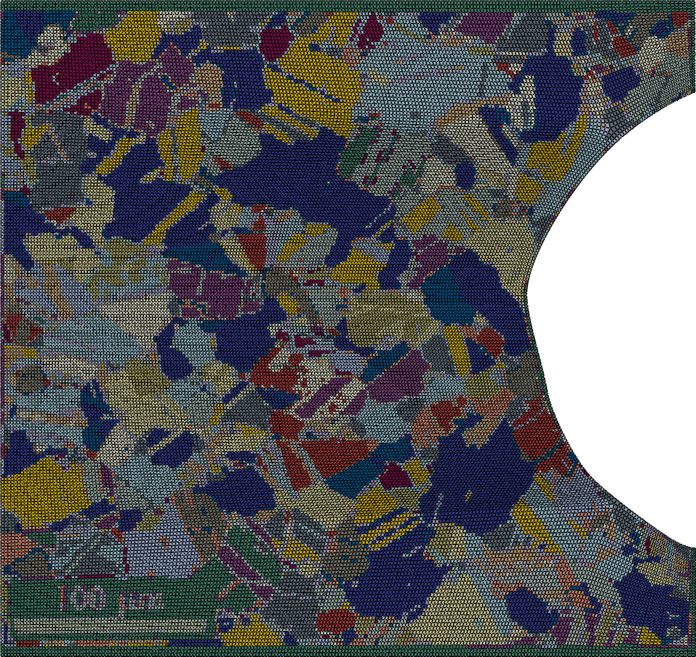

# Image colour used for material property assignment

Very zoomed out bird's eye view of what this is all about

## Bits you need to do:

1. Have an image file with some ESBD data colourisation

2. Trace an outline in some vector drawing package (I use Inkscape) - see the outline in the image above.

3. Get that geometry into Abaqus somehow and mesh it.

4. Export to an `.inp` file (don't worry about materials or section assignements though).

## Bits the code in this repo does:

5. Read in the image and use the MeanShift filter from scikit to get the same "colour" or "grain" from regions of similar colour. The code for this is [read_image.py](bin/read_image.py)

6. Read in the `.inp` file and get the centroids of each of the elements. This is in [parse_inp.py](bin/parse_inp.py)

7. Assign the element property by getting the colour from the mean shifted image. This code is in [assign_props.py](bin/assign_props.py)

8. Reassign small regions so that contiguous "blobs" of elements sharing edges and common properties have a minimum area.  This code is in [grain_partition.py](bin/grain_partition.py)

